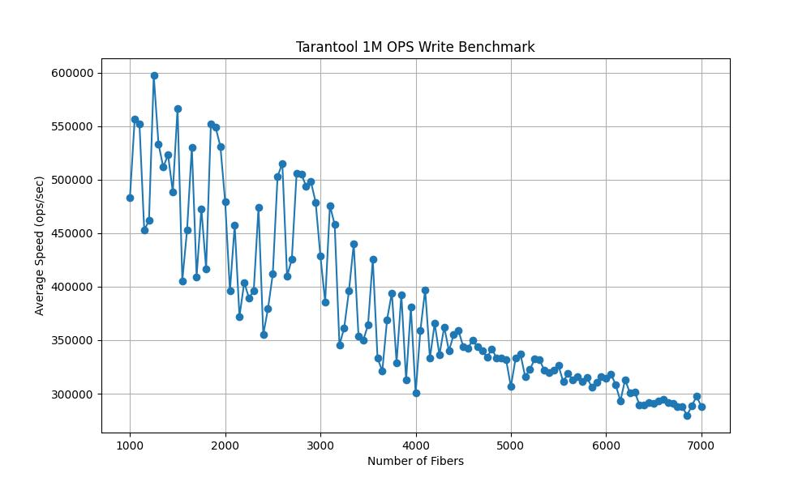
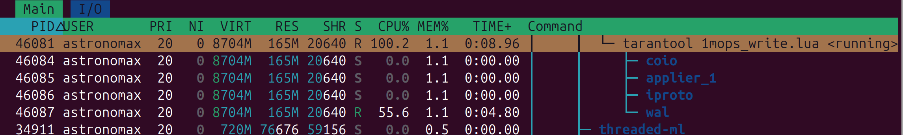
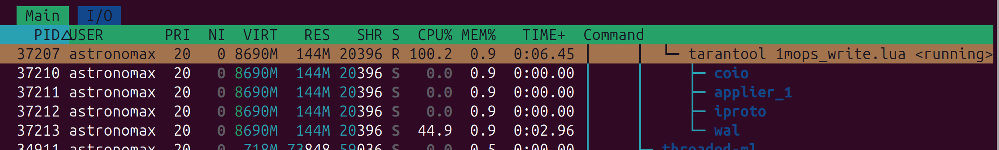
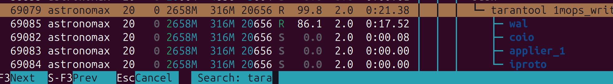

# как казаки потерянную производительность искали

Тикет: https://github.com/tarantool/tarantool/issues/11404

Попытка пофиксить: https://github.com/tarantool/tarantool/pull/11406

### Результаты запуска 1mops_write.lua на Lenovo:

<table>
  <thead>
    <tr>
      <th></th>
      <th>complete</th>
      <th>submit</th>
      <th>none</th>
    </tr>
  </thead>
  <tbody>
    <tr>
      <td><strong>Без limbo воркера </strong></td>
      <td><code>release: 510k rps</code></td>
      <td>unknown</td>
      <td>unknown</td>
    </tr>
    <tr>
      <td><strong>С limbo воркером</strong></td>
      <td><code>release: 270k rps</code></td>
      <td>unknown</td>
      <td>unknown</td>
    </tr>
  </tbody>
</table>

### Результаты запуска 1mops_write.lua на ThinkPad:

<table>
  <thead>
    <tr>
      <th></th>
      <th>complete</th>
      <th>submit</th>
      <th>none</th>
    </tr>
  </thead>
  <tbody>
    <tr>
      <td><strong>Без limbo воркера </strong></td>
      <td><code>debug: 270k rps</code> <code>release: 600k rps</code></td>
      <td>unknown</td>
      <td>unknown</td>
    </tr>
    <tr>
      <td><strong>С limbo воркером</strong></td>
      <td><code>debug: 110k rps</code><code>release: 310k rps</code></td>
      <td><code>debug: 150k rps</code> <code>release: 370k rps</code></td>
      <td><code>debug: 150k rps</code> <code>release: 370k rps</code></td>
    </tr>
  </tbody>
</table>

---

<details>
<summary>комментарий Влада</summary>

Tbh, I don't understand what does this patch optimize in performance exactly - latency, throughput? With the throughput I don't think the problem was that the confirm was synchronous. It was sync yes, but it was written for batches of transactions.

For example, if you write it slow and rare, then on the next write you simply confirm even more txns. If you write it fast and frequent, you will just write more CONFIRMs, putting pressure on the journal. And the oldest entry in the limbo will have to wait the same amount of time anyway, regardless how many confirmations are being queued after the oldest one.

Have you tried you bench with just the `fiber_call()` optimization? I don't think it must have affected the throughput, but seems like that could indeed help the latency.

Have you also tried increasing the limbo max size? I imagine that the bigger it is, the more txns we can confirm at once, which was the strong side of the old implementation.

I mean, this whole place looks like how normal transactions talk to WAL. We don't write each txn into WAL individually hoping that each txn then would be committed faster. Instead, we write them in batches. Writes themselves become longer, but average time per transaction spent for writing becomes quite smaller. I am puzzled why here it was not visible in the benches ...

I can imagine though, that perhaps we are solving a deeper problem with a bazuka here. I imagine in a single-node cluster the benchmark produces a lot of transactions in a single iteration of the event loop. We, I guess, start confirming the first one because it is immediately confirmed. But if we would have waited until the end of the iteration of the event loop, we could catch a bigger confirm LSN. Just a guess. Might be not true.

That makes me think why wasn't it already working like this before (if it wasn't and now it does). Because `fiber_wakeup()` makes the fiber get executed in the end of the event loop, no? It won't be executed right after the current fiber. Which means it should have caught the latest confirm LSN of the current event loop iteration.

I think we need to investigate deeper. Currently we absolutely surely increase the average WAL overhead per sync txn to fight probably a barely related problem, in a very artificial usecase of a single-node cluster with sync replication.
</details>

---

<details>
<summary>мой комментарий</summary>

> Have you tried you bench with just the fiber_call() optimization? I don't think it must have affected the throughput, but seems like that could indeed help the latency.

<details>
<summary>experimental diff</summary>

```diff
/** Confirm an LSN in the limbo. */
static void
txn_limbo_confirm_lsn(struct txn_limbo *limbo, int64_t confirm_lsn)
{
	assert(confirm_lsn > limbo->volatile_confirmed_lsn);
	limbo->volatile_confirmed_lsn = confirm_lsn;
+	if (limbo->worker->flags & FIBER_IS_READY) {
+		limbo->worker->flags ^= FIBER_IS_READY;
+		rlist_del_entry(limbo->worker, state);
+	} else {
+		assert(rlist_empty(&limbo->worker->state));
+	}
+	fprintf(stderr, "txn_limbo_confirm_lsn: %ld\n", confirm_lsn);
+	fflush(stderr);
+	fiber_call(limbo->worker);
-	fiber_wakeup(limbo->worker);
}

static inline int
journal_write(struct journal_entry *entry)
{
	if (journal_write_submit(entry) != 0)
		return -1;
	while (!entry->is_complete) {
		fiber_yield();
+		if (!entry->is_complete) {
+			fprintf(stderr, "early awakening\n");
+			struct synchro_request req;
+			struct vclock vclock;
+			xrow_decode_synchro(entry->rows[0], &req, &vclock);
+			fprintf(stderr, "i'm writing %ld\n", req.lsn);
+			fflush(stderr);
+		}
	}
```
</details>

<details>
<summary>output</summary>

```console
tarantool:~$ tarantool perf/lua/1mops_write.lua --nodes=1 --fibers=6000 --ops=1000000 --transaction=1 --warmup=10 --sync
...
txn_limbo_confirm_lsn: 996654
early awakening
i'm writing 990804
txn_limbo_confirm_lsn: 996655
early awakening
i'm writing 990804
txn_limbo_confirm_lsn: 996656
early awakening
i'm writing 990804
txn_limbo_confirm_lsn: 996657
early awakening
i'm writing 990804
txn_limbo_confirm_lsn: 996658
early awakening
i'm writing 990804
txn_limbo_confirm_lsn: 996659
...
```
</details>

Only `fiber_call` doesn't affect rps, if the worker keeps waiting for the write to finish. It just wakes up in vain.

<table border="0">
 <tr>
    <td>`fiber_wakeup`</td>
    <td>`fiber_call`</td>
 </tr>
 <tr>
    <td>

```console
...
# Warmup... done, lsn: 	101837
# master done 894641 ops in time: 6.892991, cpu: 10.146884
# master average speed	129789	ops/sec
# master peak speed	217559	ops/sec
1mops_master 129789 rps
```
</td>
    <td>

```console
...
# Warmup... done, lsn: 	102055
# master done 894596 ops in time: 7.226434, cpu: 10.596610
# master average speed	123794	ops/sec
# master peak speed	242514	ops/sec
1mops_master 123794 rps
```
</td>
 </tr>
</table>

> Have you also tried increasing the limbo max size? I imagine that the bigger it is, the more txns we can confirm at once, which was the strong side of the old implementation.

Now we are talking about the single-instance case, `txn_limbo_confirm_lsn` is called for **each** transaction, i.e. for each transaction we bump `limbo->volatile_confirmed_lsn` by 1 and wake up `limbo->worker`. With my patch, confirm is written for each transaction (batch size = 1), which is of course wrong. I decided to look at the size of this batch before this PR:
<details>
<summary>experimental diff</summary>

```diff
static int
txn_limbo_write_confirm(struct txn_limbo *limbo, int64_t lsn)
{
+	static int64_t prev_lsn = 0;
+	fprintf(stderr, "txn_limbo_write_confirm: %ld\n", lsn - prev_lsn);
+	fflush(stderr);
+	prev_lsn = lsn;
```
</details>

<details>
<summary>output</summary>

```console
tarantool:~$ tarantool perf/lua/1mops_write.lua --nodes=1 --fibers=6000 --ops=1000000 --transaction=1 --warmup=10 --sync
...
txn_limbo_write_confirm: 5798
txn_limbo_write_confirm: 200
txn_limbo_write_confirm: 5
txn_limbo_write_confirm: 5798
txn_limbo_write_confirm: 200
txn_limbo_write_confirm: 5
txn_limbo_write_confirm: 5798
txn_limbo_write_confirm: 200
txn_limbo_write_confirm: 5
txn_limbo_write_confirm: 5798
txn_limbo_write_confirm: 200
txn_limbo_write_confirm: 5
...
```
</details>

Increasing the maximum limbo size does not affect anything in this case, because in this test we have 6000 fibers (6000 transactions at the same time), each transaction is ~61 bytes, so the peak limbo size will be about 366000 bytes, and `replication_synchro_queue_max_size` by default is 16777216. All transactions immediately go to limbo.

I checkouted [017700dccdb04edd8470af620c69f3e7c572895b](the state) when the worker was not there yet (when there was a good result on the benchmark) to make sure that confirm was written for each transaction. And it really is:
<details>
<summary>experimental diff</summary>

```diff
static void
txn_limbo_write_confirm(struct txn_limbo *limbo, int64_t lsn)
{
+	fprintf(stderr, "txn_limbo_write_confirm: %ld\n", lsn);
+	fflush(stderr);
	assert(lsn > limbo->confirmed_lsn);
	assert(!limbo->is_in_rollback);
	limbo->confirmed_lsn = lsn;
	vclock_follow(&limbo->confirmed_vclock, limbo->owner_id, lsn);
	txn_limbo_write_synchro(limbo, IPROTO_RAFT_CONFIRM, lsn, 0, NULL);
}
```
</details>

<details>
<summary>output</summary>

```console
tarantool:~$ tarantool perf/lua/1mops_write.lua --nodes=1 --fibers=6000 --ops=1000000 --transaction=1 --warmup=10 --sync
...
txn_limbo_write_confirm: 1991437
txn_limbo_write_confirm: 1991438
txn_limbo_write_confirm: 1991439
txn_limbo_write_confirm: 1991440
txn_limbo_write_confirm: 1991441
txn_limbo_write_confirm: 1991442
txn_limbo_write_confirm: 1991443
txn_limbo_write_confirm: 1991444
txn_limbo_write_confirm: 1991445
txn_limbo_write_confirm: 1991446
...
```
</details>

It turns out that in this patch I simply reproduced the behavior that was before, when each fiber was responsible for writing confirm to its transaction. But earlier, when there was no worker, some batching still occurred in the case when the cluster consisted of **several (> 1)** instances. This batching was due to the fact that the replicas sent ack not for each transaction, but for some batch:
<details>
<summary>experimental diff</summary>

```diff
static void
txn_limbo_write_confirm(struct txn_limbo *limbo, int64_t lsn)
{
+	static int64_t prev_lsn = 0;
+	fprintf(stderr, "txn_limbo_write_confirm: %ld\n", lsn - prev_lsn);
+	fflush(stderr);
+	prev_lsn = lsn;
	assert(lsn > limbo->confirmed_lsn);
	assert(!limbo->is_in_rollback);
	limbo->confirmed_lsn = lsn;
	vclock_follow(&limbo->confirmed_vclock, limbo->owner_id, lsn);
	txn_limbo_write_synchro(limbo, IPROTO_RAFT_CONFIRM, lsn, 0, NULL);
}
```
</details>

<details>
<summary>output</summary>

```console
tarantool:~$ tarantool perf/lua/1mops_write.lua --nodes=2 --fibers=6000 --ops=1000000 --transaction=1 --warmup=10 --sync
...
txn_limbo_write_confirm: 5964
txn_limbo_write_confirm: 38
txn_limbo_write_confirm: 5964
txn_limbo_write_confirm: 38
txn_limbo_write_confirm: 5964
txn_limbo_write_confirm: 38
txn_limbo_write_confirm: 5964
txn_limbo_write_confirm: 37
txn_limbo_write_confirm: 1
txn_limbo_write_confirm: 5966
txn_limbo_write_confirm: 36
txn_limbo_write_confirm: 2827
...
```
</details>

But in this patch I forced to write confirmation immediately for each transaction without any batching at all. This is, of course, not correct. It needs to be looked into more closely, I agree that it shouldn't be fixed this way.

To summarize, now the worker that works in the master really batches records, but the batch sizes sometimes look strange: 5798, 200, 5, 5798, 200, 5, ... It would be clearer if they were all around 6000.
It's probably worth comparing the time it takes to make one confirm-writing and the time it takes to make one iteration of an event-loop (6000 fibers doing its execution step). Maybe then something will become clearer.

> Because fiber_wakeup() makes the fiber get executed in the end of the event loop, no? It won't be executed right after the current fiber. Which means it should have caught the latest confirm LSN of the current event loop iteration.

Yes, that's certainly true. Moreover, as I understand it, `fiber_wakeup` and the corresponding `fiber_call` (triggered by this `fiber_wakeup`) will be executed in **the same iteration** of the event loop (in the same iteration of `ev_run`-loop).

Let's imagine two fibers waking each other up:
<details>
<summary>experiment</summary>

```cpp
static int
fiber_f(va_list ap)
{
	(void) ap;
	struct fiber *f = (struct fiber *)(fiber()->f_arg);
	while (true) {
		fiber_wakeup(f);
		fiber_yield();
	}
	return 0;
}

f1 = fiber_new("f1", fiber_f);
f2 = fiber_new("f2", fiber_f);
f1->f_arg = f2;
f2->f_arg = f1;
fiber_set_joinable(f1, true);
fiber_set_joinable(f2, true);
fiber_wakeup(f1);
fiber_wakeup(f2);
fiber_join(f1);
fiber_join(f2);
```
</details>
All execution will happen inside `ev_invoke_pending`:
<details>
<summary>ev_invoke_pending</summary>

https://github.com/tarantool/tarantool/blob/526bc5a128f5fe9be7919ec3441aceae362d2414/third_party/libev/ev.c#L3781-L3802
</details>

The event-loop will get stuck in one iteration. No other fibers that went to sleep by calling `fiber_sleep` will receive execution anymore. Just in case, checked in gdb.

Perhaps not particularly relevant to this situation, but still an interesting fact. I thought that `fiber_wakeup` would trigger the fibers to start up on the **next iteration** of the loop.
</details>

---

<details>
<summary>комментарий Влада</summary>

Oh wow, those are cool results 🤯! Thanks for checking this all so detailed!

> Only fiber_call doesn't affect rps, if the worker keeps waiting for the write to finish. It just wakes up in vain.

Did I get it right, that `fiber_call()` alone had only slowed down the processing 🤔?

> but the batch sizes sometimes look strange: 5798, 200, 5, 5798, 200, 5, ... It would be clearer if they were all around 6000.

I firstly wanted to explain this via a lot of txns piling up while the previous confirmation is being written to WAL, but then indeed while confirmation is being written, the next batch would always be as big.

The txns in the bench - are they blocking? Or are they `wait_mode = 'submit'`? Because if they are blocking, then it might explain the thing.

Firstly a lot of txns start committing, and confirm goes to WAL to persist their result. While it is being written to WAL, you have only a small part of fibers left which produce new txns. When confirm is done, you send the next batch (small one) to WAL, and the other fibers who were just confirmed by the previous write (a lot of them) produce the next large batch. And this way they exchange somehow.

> It turns out that in this patch I simply reproduced the behavior that was before

Does this mean that the old no-worker-fiber code was also x2 faster on this bench in the single-node case?

> Yes, that's certainly true.

Hm. So this means, that if 1000 fibers call fiber_wakeup on the limbo worker, the worker will be pushed to the end of the event loop iteration. Because each wakeup will move it to the tail of the fiber list via `rlist_move_tail_entry(&cord->ready, f, state);` in `fiber_make_ready()`.

I am curious what would happen if we make the following: only call `fiber_wakeup()` where there is a reason to wakeup? Like that the volatile confirmed LSN > persisted confirmed LSN. Then we would make less of these `rlist_move_tail_entry()` calls and the closest confirm would be written sooner. Assuming that between those wakeups some other fibers were standing into the end and then we again were pushing the limbo worker to the end.

**Update**: wake it up not when volatile LSN > persisted LSN (it is always the case), but rather when the fiber just isn't already woken up. So it doesn't have `FIBER_IS_READY` flag. Or a less "intrusive way" would be have a flag in the limbo like "has work". When it is false, we wake the fiber up and set the flag. When it is true, we do nothing. And the worker itself will remove the flag before going to sleep in `txn_limbo_worker_f()`.

We then also get rid of the spurious wakeups of its journal write of the currently being written confirmation entry.
</details>

---

### При использовании 3000 файберов вместо 6000 производительность подскочила на 70%:
```console
~/dev/tarantool/release-build/src/tarantool ~/dev/tarantool/perf/lua/1mops_write.lua --nodes=1 --fibers=3000 --ops=1000000 --transaction=1 --warmup=10 --sync
# making 1000000 REPLACE operations,
# 1 operations per txn,
# using 3000 fibers,
# in a replicaset of 1 nodes,
# using HASH index type
# with WAL mode write
# 
# promoting
# done
# Warmup... done, lsn: 	101833
# master done 898182 ops in time: 1.683649, cpu: 2.620826
# master average speed	533473	ops/sec
# master peak speed	593731	ops/sec
1mops_master 533473 rps
```



Странная зависимость rps от количества файберов. Примерно до 4500 разброс какой-то аномально непредсказуемый. Хорошо бы как-то понять, что меняется при > 4500 файберов.

### CPU usage from htop:

без вокера:


c вокером:


Какой-то значимой разницы не обнаружено. Загруженность WAL в обоих случаях 45-55%. Tx в обоих случаях загружен в 100%.
Если TX загружен в 100%, не совсем понятно, откуда вообще могло взяться какое-то различие в rps.

### Посмотрим на один файбер (`--fibers=1` ThinkPad):

<table>
  <thead>
    <tr>
      <th>complete</th>
      <th>submit</th>
      <th>none</th>
    </tr>
  </thead>
  <tbody>
    <tr>
      <td><code>release: 94k rps</code></td>
      <td><code>release: 540-610k rps</code></td>
      <td><code>release: 610k rps</code></td>
    </tr>
  </tbody>
</table>



Один файбер с wait='complete' загружает Tx в 45%. В 100% Tx начинает загружаться только после 10 файберов. И как раз примерно на этих параметрах (10-15 файберов) начинается нормальная производительность.

<details>
<summary>Интересно то, как планируются файберы:</summary>

```
transfer from: 1mops_write.lua to sched


schedule 15 fibers
transfer from: sched to loader1
transfer from: loader1 to loader2
transfer from: loader2 to loader3
transfer from: loader3 to loader4
transfer from: loader4 to loader5
transfer from: loader5 to loader6
transfer from: loader6 to loader7
transfer from: loader7 to loader8
transfer from: loader8 to loader9
transfer from: loader9 to loader10
transfer from: loader10 to loader11
transfer from: loader11 to loader12
transfer from: loader12 to loader13
transfer from: loader13 to loader14
transfer from: loader14 to loader15
transfer from: loader15 to sched

## Здесь файбер 1mops_write.lua завел 15 файберов, запланировал каждый, и вот они все по порядку поисполнялись (скорее всего до цикла ожидания завершения записи). Исполнение началось с планировщика и вернулось обратно в него.

schedule 1 fibers
transfer from: sched to lua
transfer from: lua to sched
schedule 1 fibers
transfer from: sched to 1mops_write.lua
transfer from: 1mops_write.lua to sched

## Здесь sched исполняет cbus_process и вызывает txn_on_journal_write для каждой из транзакций (они все уже успели записаться). Из txn_on_journal_write он будит каждого из loader'ов, а также вызывает txn_limbo_ack, откуда будит воркера:

## #2  0x627cb25e3499 in txn_on_journal_write+473
## fiber sched wakes up fiber loader1
## #2  0x627cb25e36c0 in txn_on_journal_write+1024
## fiber sched wakes up fiber txn_limbo_worker
## #2  0x627cb25e3499 in txn_on_journal_write+473
## fiber sched wakes up fiber loader2
## #2  0x627cb25e36c0 in txn_on_journal_write+1024
## fiber sched wakes up fiber txn_limbo_worker
## #2  0x627cb25e3499 in txn_on_journal_write+473
## fiber sched wakes up fiber loader3
## #2  0x627cb25e36c0 in txn_on_journal_write+1024
## fiber sched wakes up fiber txn_limbo_worker
## #2  0x627cb25e3499 in txn_on_journal_write+473
## fiber sched wakes up fiber loader4
## #2  0x627cb25e36c0 in txn_on_journal_write+1024

schedule 16 fibers
transfer from: sched to loader1
transfer from: loader1 to txn_limbo_worker

## Понятно, почему txn_limbo_worker попал после loader1, но перед loader2 и другими. txn_on_journal_write добавляет в список loader1 и следом за ним txn_limbo_worker, а все дальнейшие попытки разбудить txn_limbo_worker ничего не делают (не перекладывают его в конец), потому что есть проверка:

## const int no_flags = FIBER_IS_READY | FIBER_IS_DEAD | ## FIBER_IS_RUNNING;
## 	if ((f->flags & no_flags) == 0)
## 		fiber_make_ready(f);

Здесь мы запушили в wal запись COMFIRM на lsn ~= 23.

transfer from: txn_limbo_worker to loader2
transfer from: loader2 to loader3
transfer from: loader3 to loader4
transfer from: loader4 to loader5
transfer from: loader5 to loader6
transfer from: loader6 to loader7
transfer from: loader7 to loader8
transfer from: loader8 to loader9
transfer from: loader9 to loader10
transfer from: loader10 to loader11
transfer from: loader11 to loader12
transfer from: loader12 to loader13
transfer from: loader13 to loader14
transfer from: loader14 to loader15
transfer from: loader15 to sched

Здесь все файберы вышли из ожидания записи и перешли в ожидание CONFIRM (txn_limbo_wait_complete).

## Здесь уже не так понятно, почему они все по порядочку запланировались.
## Поэтому я добавил принты вида:
## #2  0x5e3154714499 in txn_on_journal_write+473
## fiber sched wakes up fiber loader1

## И оказывается их всех вот так по порядочку разбудил `txn_on_journal_write`. То есть, как мы и предполагали, файберы остановились на ожидании завершения записи. И вот sched прокрутил колбеки на эти записи.

## static struct cmsg_hop wal_request_route[] = {
## 	{wal_write_to_disk, &wal_writer_singleton.tx_prio_pipe},
## 	{tx_complete_batch, NULL},
## };

## ev_run -> ev_invoke_pending -> tx_prio_cb -> cbus_process -> cmsg_deliver -> tx_complete_batch -> txn_on_journal_write

## Почему tx_prio имеет суффикс prio? В чем заключается приоритетность? А в том, откуда вызывается cbus_process. В не приоритетном случае типа wal_worker, cbus_process вызывается из cbus_loop. То есть cbus_loop крутится в wal_worker и илдит в ожидании следующей порции входных данных. cpipe_flush делает ev_async_send в endpoint->async. В случае с wal_worker на этом событии установлен колбек fiber_schedule_cb, который как раз будит файбер, в котором крутится cbus_loop, чтобы он пошел и подхватил очередную порцию данных из endpoint->output.
В случае с tx_prio, никакой cbus_loop не крутится в файбере, у него просто установлен другой колбек на endpoint->async - tx_prio_cb, который тут же зовет cbus_process. То есть обработка пайпа происходит сразу же.

В одном случае ev_async_send ----> ev_invoke_pending -> tx_prio_cb и здесь же сразу вызываются колбеки на пришедшие сообщения.

В другом случае ev_async_send ----> ev_invoke_pending -> fiber_schedule_cb -> fiber_wakeup затем отрабатывает цепочка запланированных файберов и в конце очередь доходит до нашего wal_worker, который повызывает колбеки на пришедшие сообщения.

Грубо говоря приоритетный endpoint не ждет своей очереди, пока отработает куча других файберов, которые к этому моменту успели напланироваться (встать в ready), а обрабатывает свои колбеки первым.


Здесь произошел вызов колбека tx_complete_batch на запись CONFIRM, который запланировал разбудить worker и соответственно тут же будит его. Но здесь worker никакую новую запись не порождает, потому что CONFIRM уже записан на последнюю транзакцию (на первый блок из 15 транзакций).


schedule 1 fibers
transfer from: sched to txn_limbo_worker
transfer from: txn_limbo_worker to sched

Но здесь воркер вызывает txn_limbo_read_confirm, откуда он вызывает fiber_wakeup на каждый из loader'ов. Сейчас все 15 лоадеров позовут yield.

schedule 15 fibers
transfer from: sched to loader1
yield
transfer from: loader1 to loader2
yield
transfer from: loader2 to loader3
yield
transfer from: loader3 to loader4
yield
transfer from: loader4 to loader5
yield
transfer from: loader5 to loader6
yield
transfer from: loader6 to loader7
yield
transfer from: loader7 to loader8
yield
transfer from: loader8 to loader9
yield
transfer from: loader9 to loader10
yield
transfer from: loader10 to loader11
yield
transfer from: loader11 to loader12
yield
transfer from: loader12 to loader13
yield
transfer from: loader13 to loader14
yield
transfer from: loader14 to loader15
yield
transfer from: loader15 to sched

## А здесь файберы почему-то начинают будиться из fiber_schedule_timeout. Выглядит так будто бы мы из каждого из файберов позвали fiber_sleep, хотя на самом деле мы позвали yield.

Не понятно почему в лоадере мы вызываем yield после транзакции, и не понятно, кто их вообще будит после этого yield:

## local function fiber_load(start, s)
##     start = start % 1000000 -- limit the size of space to 1M ## elements
##     for _ = 1, trans_per_fiber do
##         box.begin()
##         for _ = 1, ops_per_txn do
##             s:replace{start}
##             start = start + 1
##         end
##         box.commit({wait='complete'})
##         fiber.yield()
##     end
## end

ОКАЗЫВАЕТСЯ lbox_fiber_yield = fiber_sleep(0);

Здесь произошло ev_invoke_pending -> fiber_schedule_timeout -> fiber_wakeup(loader1)

schedule 1 fibers
transfer from: sched to loader1
transfer from: loader1 to sched

ev_invoke_pending -> fiber_schedule_timeout -> fiber_wakeup(loader15)

schedule 1 fibers
transfer from: sched to loader15
transfer from: loader15 to sched

ev_invoke_pending -> fiber_schedule_timeout -> fiber_wakeup(loader13)

schedule 1 fibers
transfer from: sched to loader13
transfer from: loader13 to sched

ev_invoke_pending -> fiber_schedule_timeout -> fiber_wakeup(loader12)

schedule 1 fibers
transfer from: sched to loader12
transfer from: loader12 to sched
schedule 1 fibers
transfer from: sched to loader11
transfer from: loader11 to sched
schedule 1 fibers
transfer from: sched to loader4
transfer from: loader4 to sched
schedule 1 fibers
transfer from: sched to loader9
transfer from: loader9 to sched
schedule 1 fibers
transfer from: sched to loader8
transfer from: loader8 to sched
schedule 1 fibers
transfer from: sched to loader7
transfer from: loader7 to sched
schedule 1 fibers
transfer from: sched to loader14
transfer from: loader14 to sched
schedule 1 fibers
transfer from: sched to loader5
transfer from: loader5 to sched
schedule 1 fibers
transfer from: sched to loader6
transfer from: loader6 to sched
schedule 1 fibers
transfer from: sched to loader10
transfer from: loader10 to sched
schedule 1 fibers
transfer from: sched to loader2
transfer from: loader2 to sched
schedule 1 fibers
transfer from: sched to loader3
transfer from: loader3 to sched

## Странно, что каждое пробуждение попало в свою итерацию цикла.
## Здесь потерялись два последних файбера - 2 и 3. Их отрезало, потому что WAL еще не успел записать эти две транзакции. Отсюда и берется эта рандомизация: sleep'ы перемешивают транзакции, запись в отдельном потоке периодически отрезает какой-то суффикс (будит не все 15 воркеров, а лишь какой-то префикс, который успел записаться).

schedule 14 fibers
transfer from: sched to loader1
transfer from: loader1 to txn_limbo_worker
transfer from: txn_limbo_worker to loader15
transfer from: loader15 to loader13
transfer from: loader13 to loader12
transfer from: loader12 to loader11
transfer from: loader11 to loader4
transfer from: loader4 to loader9
transfer from: loader9 to loader8
transfer from: loader8 to loader7
transfer from: loader7 to loader14
transfer from: loader14 to loader5
transfer from: loader5 to loader6
transfer from: loader6 to loader10
transfer from: loader10 to sched
```
</details>

# Cringe

Проблема была в том, что запись CONFIRM считалась за операцию, потому что она бампает lsn. Соответственно, чем больше CONFIRM'ов записал, тем больше rps. Самое интересное, что я знал об этой проблеме в контексте другого тикета, появившегося прямо одновременно с этим, и у меня даже уже был [фикс-патч](https://github.com/tarantool/tarantool/pull/11415) в момент всего этого разбирательства. Но при этом я почему-то даже не подумал, что эта херня может аффектить и эту ситуацию в том числе.

И в принципе понятно, почему с уменьшением кол-ва файберов, росли rps - чаще писались CONFIRM'ы. Хотя все еще не понятно, почему там настолько большой разброс возникал при этом на графике.
