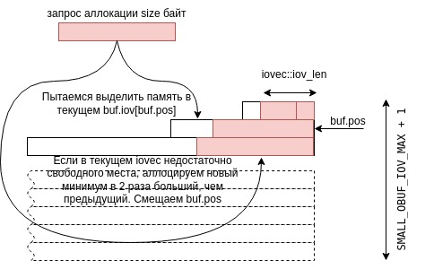

# obuf

[obuf](https://github.com/tarantool/small/blob/master/include/small/obuf.h)  

**obuf** - output buffer



```C
enum { SMALL_OBUF_IOV_MAX = 31 };
/**
 * An output buffer is a vector of struct iovec
 * for writev().
 * Each iovec buffer is allocated using slab allocator.
 * Buffer size grows by a factor of 2. With this growth factor,
 * the number of used buffers is unlikely to ever exceed the
 * hard limit of SMALL_OBUF_IOV_MAX. If it does, an exception is
 * raised.
 */
struct obuf
{
	struct slab_cache *slabc;
	/** Position of the "current" iovec. */
	int pos;
	/* The number of allocated iov instances. */
	int n_iov;
	/* How many bytes are in the buffer. */
	size_t used;
	/**
	 * iov[0] size (allocations are normally a multiple of this number),
	 * but can be larger if a large chunk is requested by
	 * obuf_reserve().
	 */
	size_t start_capacity;
	/** How many bytes are actually allocated for each iovec. */
	size_t capacity[SMALL_OBUF_IOV_MAX + 1];
	/**
	 * List of iovec vectors, each vector is at least twice
	 * as big as the previous one. The vector following the
	 * last allocated one is always zero-initialized
	 * (iov_base = NULL, iov_len = 0).
	 */
	struct iovec iov[SMALL_OBUF_IOV_MAX + 1];
\#ifndef NDEBUG
	/**
	 * The flag is used to check that there is no 2 reservations in a row.
	 * The same check that has the ASAN version.
	 */
	bool reserved;
\#endif
};
```

Внутри содержит массив `iov` из структур `struct iovec`:

```C
/* Structure for scatter/gather I/O.  */
struct iovec
  {
    void *iov_base;	/* Pointer to data.  */
    size_t iov_len;	/* Length of data.  */
  };
```

`obuf::iovec` аллоцируется с помощью `slab` аллокатора.

`obuf::pos`: позиция текущего `iovec` в массиве  
  
`obuf::n_iov`: количество аллоцированных `iovec`. (они аллоцируются по необходимости, а не все сразу)

`obuf::used`: количество байт в буффере

`obuf::start_capacity`: размер `iov[0]`

`obuf::capacity[32]`: размеры каждого из `iovec`

`obuf::iov[32]`: массив `iovec`, каждый **минимум** в 2 раза больше предыдущего. Размер каждого всегда является степенью 2 (иногда следующий может быть больше в 4, 8 и т.д. раз)

Вектор `iovec`, идущий следом за `pos`, всегда инициализируется 0 (`iov_base = NULL, iov_len = 0`).

```c
void
obuf_create(struct obuf *buf, struct slab_cache *slabc, size_t start_capacity)
```
\- инициализирует `obuf`, но ничего не аллоцирует

```c
void
obuf_reset(struct obuf *buf)
```
\- инициализирует `obuf`, как пустой

```c
void
obuf_destroy(struct obuf *buf)
```
\- освобождает память  
  
```c
static inline bool
obuf_is_initialized(const struct obuf *buf)
```
\- возвращает 1 после `obuf_create`, и 0 после `obuf_destroy`

```c
static inline void *
obuf_reserve(struct obuf *buf, size_t size)
```
\- если в текущем `iovec` хватает места (`capacity[buf->pos] - iov[buf->pos].iov_len >= size`), то просто отдает кусок размера `size` из текущего `iovec`, обновляет `iov[buf->pos].iov_len`. Иначе, если места не хватает, смотрим на следующий `iovec`: если он ещё не аллоцирован аллоцируем $min_k 2^k$, т.ч. $2^k \geq size$, если уже был аллоцирован (а такое может быть, как мы увидим позже) - переаллоцируем.

```c
static inline void *
obuf_alloc(struct obuf *buf, size_t size)
```
\- вызывает `obuf_reserve` при необходимости, затем увеличивает `iov_len` на `size`.

У `obuf` есть возможность откатываться до какого-то прошедшего состояния.

```c
static inline struct obuf_svp
obuf_create_svp(struct obuf *buf)
{
	struct obuf_svp svp;
	svp.pos = buf->pos;
	svp.iov_len = buf->iov[buf->pos].iov_len;
	svp.used = buf->used;
	return svp;
}
```
\- создает savepoint `struct obuf_svp`

```C
/**
 * Output buffer savepoint. It's possible to
 * save the current buffer state in a savepoint
 * and roll back to the saved state at any time
 * before obuf_reset()
 */
struct obuf_svp
{
	size_t pos;
	size_t iov_len;
	size_t used;
};
```

```c
void
obuf_rollback_to_svp(struct obuf *buf, struct obuf_svp *svp)
```
\- откатывает состояние буффера обратно (забывает какой-то суффикс данных в буффере).
